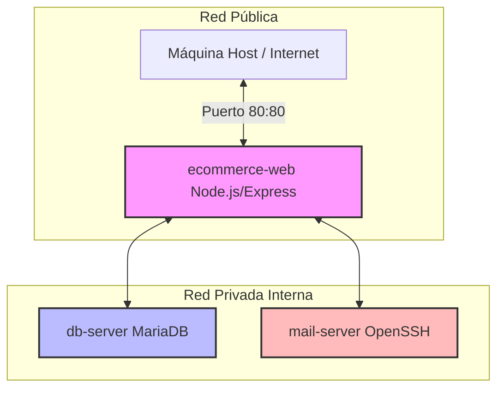

# Arquitectura de Laboratorio Vulnerable de E-Commerce

Este entorno ha sido diseñado como un laboratorio controlado para prácticas docentes y entrenamiento en pruebas de penetración (Ethical Hacking).

---

## 1. Arquitectura de Red y Segmentación

El laboratorio consta de tres contenedores interconectados usando dos redes lógicas para restringir el acceso directo y facilitar la simulación de escenarios de movimiento lateral:



### Contenedores y Funciones:
1. **`ecommerce-web`** (Node.js/Express): 
   - Expuesto en el puerto 80 del host.
   - Actúa como la puerta de entrada a la red privada.
2. **`db-server`** (MariaDB):
   - Aislado completamente de la red pública.
   - Contiene la base de datos `ecommerce` y la tabla de usuarios con credenciales administrativas.
3. **`mail-server`** (SSH/LinuxServer):
   - Simula un servidor de correo interno.
   - Configurado con autenticación por contraseña para el usuario `mailadmin`.

---

## 2. Vulnerabilidades Implementadas

El entorno incluye deliberadamente los siguientes fallos de seguridad comunes:

### A. Deficiencias Criptográficas (CWE-319)
- Todo el tráfico web y la autenticación administrativa ocurren a través de **HTTP en texto plano** en el puerto 80.
- Esto permite a un atacante en la red capturar credenciales en tránsito (por ejemplo, mediante la captura de paquetes con `tcpdump` o `Wireshark`).

### B. Inyección SQL (CWE-89)
- El buscador de productos en `/search` concatena directamente la entrada del usuario (`req.query.q`) dentro del string de la consulta SQL:
  ```javascript
  const sql = `SELECT * FROM products WHERE name LIKE '%${query}%' OR description LIKE '%${query}%'`;
  ```
- **Vector de explotación**: El alumno puede inyectar sentencias SQL para extraer datos de la tabla de usuarios u omitir la lógica de búsqueda.

### C. Exposición de Credenciales y Mala Configuración (CWE-538 / CWE-200)
- El servidor Node.js tiene habilitada la visualización del contenido de la carpeta `/src` a través del middleware `serve-index`, simulando la mala configuración `Options +Indexes` de Apache.
- Un archivo `.env` conteniendo credenciales críticas está almacenado directamente dentro del directorio de código web expuesto (`/src/.env`), permitiendo que cualquier usuario web lo lea mediante navegación simple.

### D. Escalada de Privilegios Local mediante SUID (CWE-269)
- En el Dockerfile del contenedor web, se establece intencionalmente el bit SUID en el binario del sistema `find`:
  ```dockerfile
  RUN chmod u+s /usr/bin/find
  ```
- El proceso principal de Node corre bajo el usuario sin privilegios `node`. En caso de que el atacante consiga ejecución remota de comandos (RCE), podrá elevar sus privilegios a `root` ejecutando:
  ```bash
  find . -exec whoami \;
  ```

### E. Movimiento Horizontal mediante Reutilización de Credenciales (CWE-259 / CWE-287)
- El contenedor `mail-server` tiene habilitado SSH para el usuario `mailadmin`.
- La contraseña configurada para `mailadmin` es idéntica a la contraseña expuesta en el archivo `.env` (`cinvestav123`).
- **Vector de explotación**: Una vez que el alumno recupera las credenciales de la base de datos del archivo expuesto o a través de la inyección SQL, puede reutilizarlas para acceder por SSH al servidor de correos remoto desde el contenedor web comprometido.

---

## 3. Instrucciones de Despliegue y Pruebas

### Levantar el laboratorio:
Desde la raíz del proyecto, ejecute:
```bash
docker compose up --build -d
```

### Verificación del entorno:
- **Buscador de productos**: Ingrese a [http://localhost/search](http://localhost/search).
- **Lectura de archivo sensible**: Ingrese a [http://localhost/src/.env](http://localhost/src/.env) para verificar la filtración del archivo de configuración.
- **Inyección SQL**: En la caja de búsqueda, ingrese `' UNION SELECT 1, username, password FROM users -- ` para obtener los datos de la base de datos.
- **Acceso por SSH (Movimiento Lateral)**: Ejecute un shell dentro del contenedor web y conéctese al servidor de correo:
  ```bash
  docker exec -it ecommerce-web bash
  ssh mailadmin@mail-server
  # Ingrese la contraseña obtenida del .env: cinvestav123
  ```
